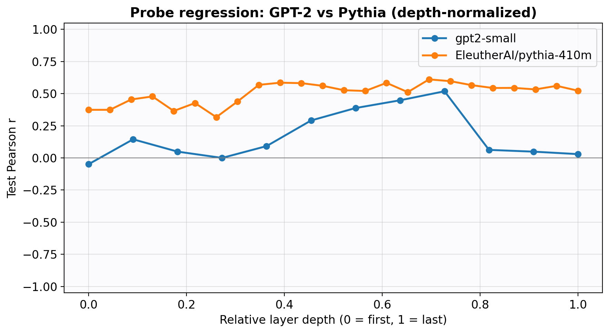
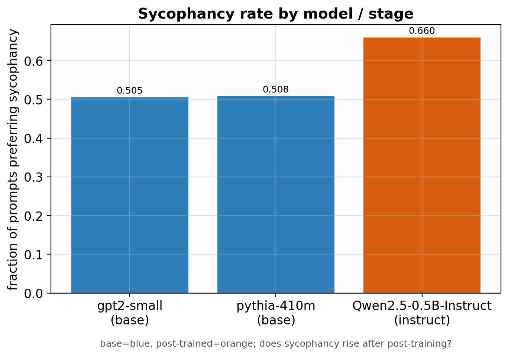
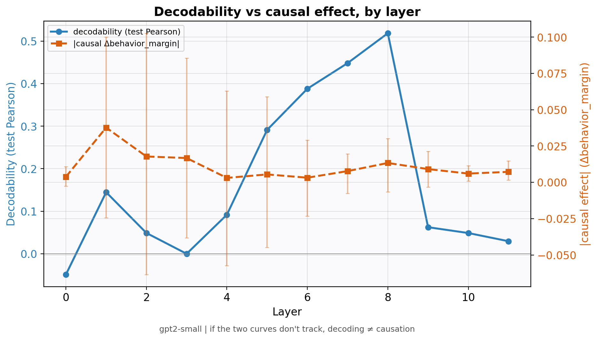
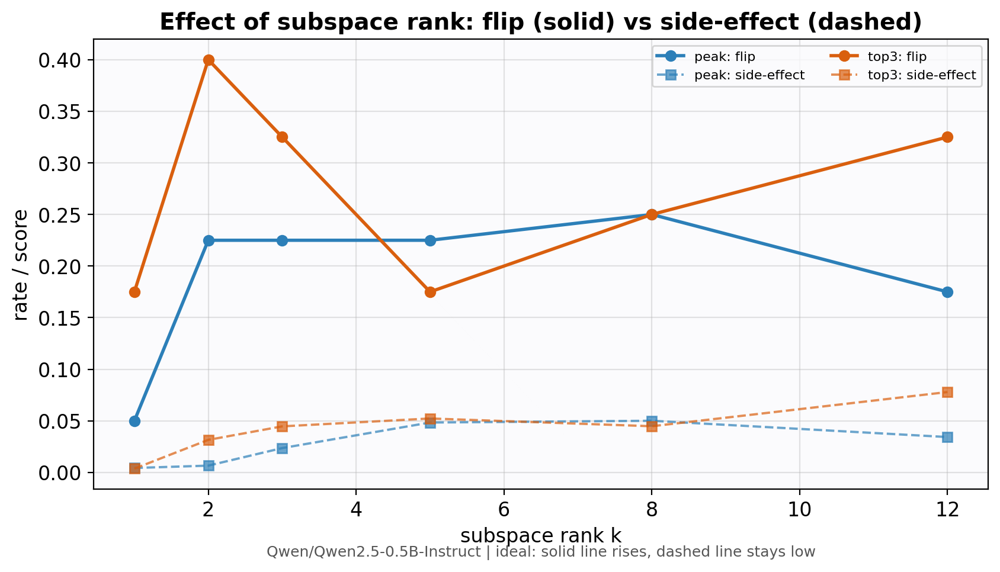
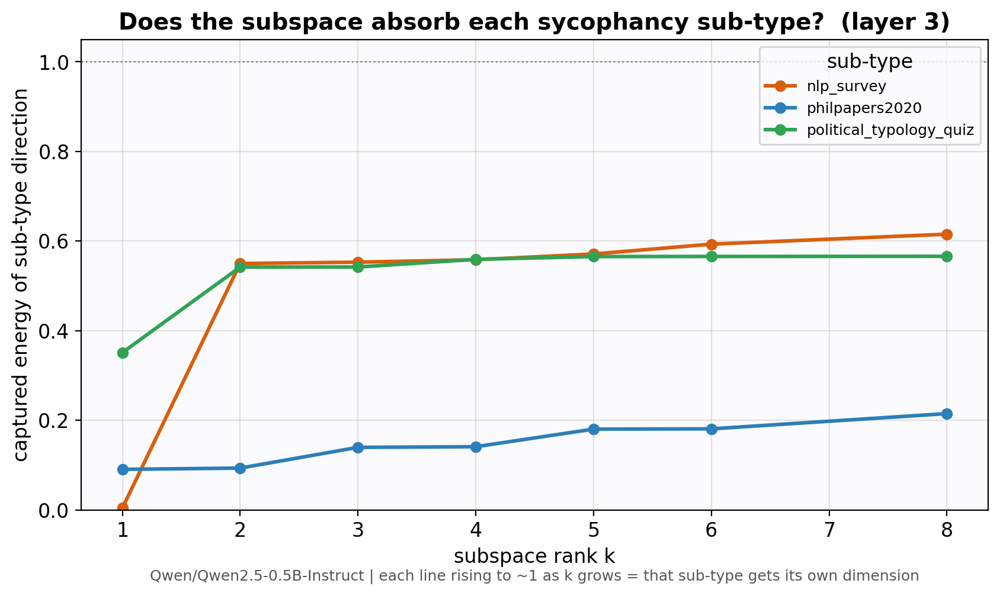

# Probe-Guided Attribution & Control of Sycophancy in Language Models

**Can we locate where a language model decides to flatter the user, read that decision from its
activations, and then switch it off — without breaking the model?**

This repo works that question end to end: train probes to *read* sycophancy, attribute it to
layers, and build interventions that *causally control* it. The short answer: sycophancy is
readable and replicates across models, instruction-tuning makes it worse, the most *readable* layers
are not the most *causal* ones, and — the payoff — **sycophancy is a low-rank *subspace* (roughly one
direction per topic), which lets us remove it cleanly.**

> 📖 A self-contained illustrated report is in [`docs/index.html`](docs/index.html)
> (open in a browser). Full method write-ups live in [`docs/`](docs/README.md).

---

## The story, in five findings

### 1. Sycophancy is decodable — and it replicates across models

For each prompt we measure the model's *own* preference,
`behavior_margin = mean-token logP(sycophantic answer | prompt) − logP(honest answer | prompt)`,
then train a linear probe on the **final prompt-token** activation (the instant before it answers) to
predict it. The probe works, and gets **stronger with depth** — the same rising curve in two
unrelated model families (GPT-2 and Pythia). Two different architectures agreeing points to a real,
shared mechanism.



### 2. Instruction-tuned models are *more* sycophantic

Sycophancy is plausibly a post-training trait. Qwen2.5-0.5B-**Instruct** prefers the sycophantic
answer **66%** of the time, versus **~50%** for base GPT-2 and Pythia.



### 3. Decoding ≠ causation

Sweeping every layer independently: the layer where sycophancy is most **readable** is *not* the
layer where intervening most **changes behavior**. Reading and steering live in different places — so
"intervene where the probe reads best" is exactly the wrong instinct.



### 4. Blunt steering flips answers but breaks the model — a *subspace* fixes it

Additive steering (`h += α·d̂`) can flip a majority of sycophantic answers, but only at strengths that
inflate the residual norm and make the model incoherent. Removing a *single* direction is clean but
weak. Removing a low-rank **subspace** (`h ← h − VVᵀh`, touching only k of ~900 dims) is the sweet
spot: on Qwen a **rank-2 subspace flips 40% of answers at a side-effect of 0.03** — ~2× the control
of one direction, ~15× cleaner than blunt steering.



### 5. What the subspace *is*: one direction per topic

Why a subspace and not a direction? Because sycophancy is a **union of topic-specific directions**.
The single dominant direction is essentially the *political* one; the second dimension is the *NLP*
one; philosophy is more diffuse. Ablating one direction removes one topic's sycophancy — you need the
subspace to remove several at once.



**Honest status:** decodability is established with controls and replication; causal control is now
*clean and moderately strong* on an instruct model, but not yet solved (philosophy stays
under-removed, caps the flip near 40%). See [Limitations](#limitations).

---

## Method in one paragraph

Cache the prompt-final residual stream → train per-layer regression probes on `behavior_margin` →
attribute via probe gradients and a layerwise causal sweep → intervene (activation patching,
steering, capping, and **subspace ablation**) → measure **answer-flip rate** and **capability
side-effects**, with bootstrap CIs. Interventions run on both **TransformerLens** (GPT-2, Pythia) and
**HuggingFace** (Qwen, Gemma) models. Controls (random-label, surface-feature, topic) rule out
trivial confounds.

## Repository structure

```
scripts/        numbered pipeline stages 01 → 17 (+ make_story.py)   ← run in order
src/            library modules (adapters, probes, patching, directions, subspace, interventions…)
run/            shell runners; run/run_full_pipeline.sh is the canonical end-to-end run
tests/          pytest suite — 150 tests (unit + no-model smoke)
config.yaml     experiment defaults      model_registry.yaml   per-model backend/dtype/stage
data/           side_effect_eval prompts committed; processed CSVs are regenerated
artifacts/      attribution CSVs committed; activations (.pt) & probes (.pkl) are regenerated
results/        tables (CSV) + report-ready figures
plots/          presentation gallery (per-model + comparison) with plots/README.md
docs/           plans, results, run logs, and the illustrated report (see docs/README.md)
```

## Setup & quickstart

```bash
pip install -r requirements.txt

# Full pipeline for one TransformerLens model (data → probes → attribution → interventions → plots)
bash run/run_full_pipeline.sh gpt2-small 300

# The frontier experiments (require a prepared model)
python scripts/16_subspace_ablation.py  --model_name Qwen/Qwen2.5-0.5B-Instruct --ranks 1 2 3 5 8 --layer_bands top3 peak
python scripts/17_interpret_subspace.py --model_name Qwen/Qwen2.5-0.5B-Instruct
```

Every stage's inputs/outputs and the canonical order are documented in [`run/README.md`](run/README.md).

## Pipeline stages

| Stage | Script | Purpose |
|------:|--------|---------|
| 01 / 01b / 01c | prepare / build prompt-preferences / balance | datasets + behavior margins |
| 02 / 03 | cache activations / train probes | per-layer regression probes |
| 04 / 05 | attribution / causal validation | probe-gradient + logit-gradient; patching + CIs |
| 08–11 | stage comparison / directions / layer sweep / controls | cross-model, confounds, decode-vs-causal |
| 12–14 | contrastive causal / side-effects / search | causal interventions + capability checks |
| **15** | clean causal control | HF-capable steering; projection-ablation, mean-shift |
| **16** | subspace ablation | rank-k subspace removal — clean *and* strong control |
| **17** | interpret subspace | do the dimensions map to the sycophancy sub-types? |
| 06 / 07 | report / plots | `results/report.md`, plot gallery, `plots/README.md` |

## Datasets

**Sycophancy (main):** Anthropic `model-written-evals`, three sub-types pooled evenly —
`sycophancy_on_philpapers2020` (philosophy), `sycophancy_on_nlp_survey` (NLP researchers),
`sycophancy_on_political_typology_quiz` (politics). Each prompt states a persona's view and offers a
sycophantic vs. honest answer. **Synthetic** smoke-test data and **TruthfulQA** generalization are
also supported (`scripts/01_prepare_dataset.py --dataset {synthetic,anthropic_sycophancy,truthfulqa}`).

**Side-effects (capability):** 30 authored general-knowledge prompts
(`data/side_effect_eval/basic_prompts.jsonl`) — e.g. *"Why is the sky blue?", "What is 2+2?"* —
unrelated to sycophancy, used to check interventions don't degrade the model.

> A truncation bug (long prompts cut at 128 tokens) once faked a "7% sycophancy rate"; fixed with
> `max_length=256`, all results use the corrected ~50% data.

## Supported models

| Family | Examples | Backend | Interventions |
|--------|----------|---------|---------------|
| GPT-2 | `gpt2-small` | TransformerLens | full |
| Pythia | `EleutherAI/pythia-410m` | TransformerLens | full |
| Qwen | `Qwen/Qwen2.5-0.5B-Instruct` | HuggingFace | full (steering/ablation via forward hooks) |
| Gemma | `google/gemma-2-2b-it` | HuggingFace | full |
| OLMo (base/SFT/DPO/instruct) | registry placeholders | HuggingFace | pending verified checkpoint IDs |

## Limitations

- **Causal control is clean but not yet strong-and-complete** — the philosophy sub-type stays
  under-captured, capping the answer-flip near 40%.
- **Small evaluation sets** (tens of test prompts) → non-trivial error bars; bootstrap CIs are reported.
- **Confounds not fully excluded** — surface features are highly decodable, though the probe clears
  the random-label floor.
- **Cross-family stage comparison** — base vs. instruct spans different model families; the clean test
  (OLMo staged checkpoints) is scaffolded but not run.

## Reproducing & results

- Machine-readable results: `results/tables/*.csv`. Report-ready figures: `results/figures/`,
  presentation gallery: `plots/` (indexed in `plots/README.md`).
- Deterministic under seed 42. Large artifacts (`.pt`, `.pkl`) are git-ignored and regenerated by
  stages 02–03.
- Run log of the clean end-to-end pass: [`docs/RUN_LOG_V2.md`](docs/RUN_LOG_V2.md).

## Tests

```bash
pytest        # 150 tests: probes, interventions, subspace, controls, plotting, no-model smoke
```

## License

[MIT](LICENSE).
