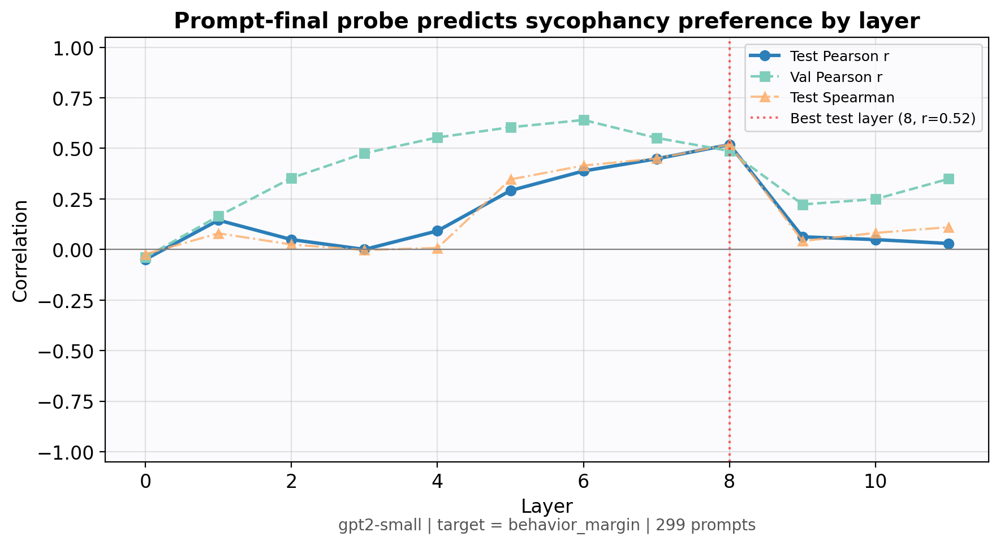
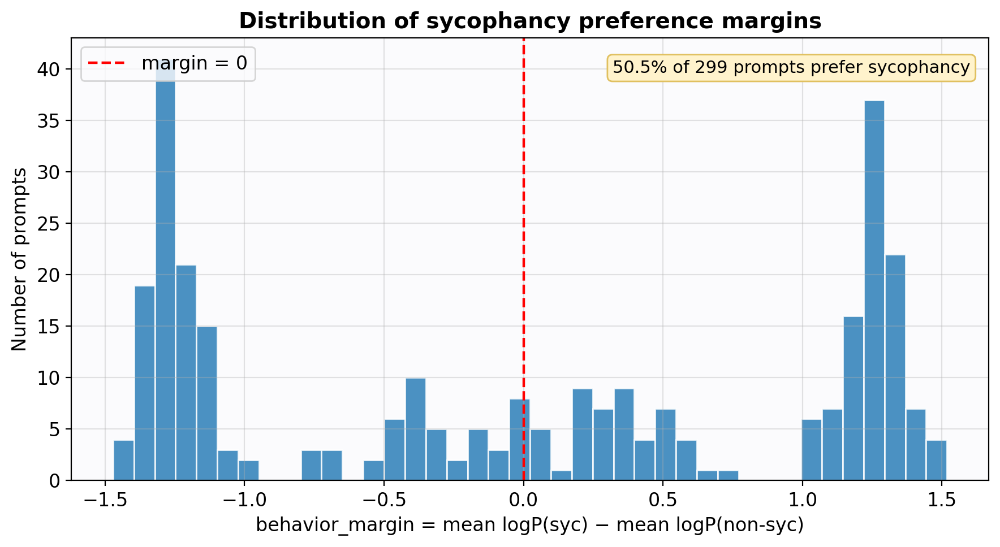
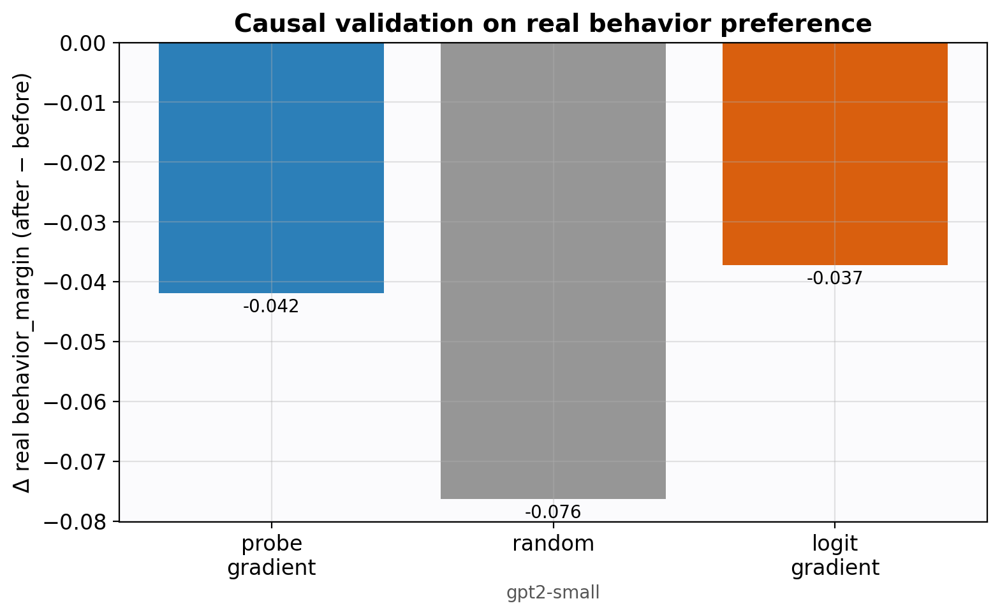

# Probe-Guided Attribution for Sycophancy
### A one-page research summary · 2026-06-14

---

## The idea in one line

Instead of attributing sycophancy to a single output-token logit (e.g. the logit for "Yes"),
we **train a behavioral probe** on a model's prompt-final activations to predict its own
**sycophancy preference**, then attribute and causally test the layers responsible.

## Why it matters

"Sycophancy" is a *behavior*, not a token. The logit for "Yes" fires in countless harmless
contexts, so logit-gradient attribution is a poor proxy. A probe trained on the behavior itself
gives a semantically targeted signal — and lets us ask **where in the network the model decides
to agree with the user before it has said anything.**

## Setup

- **Data:** Anthropic `model-written-evals` sycophancy subsets (philosophy / NLP / politics),
  300 prompts. Each prompt pairs a sycophantic answer with an honest answer.
- **Target (per prompt):**
  `behavior_margin = mean-token logP(sycophantic | prompt) − mean-token logP(honest | prompt)`.
  Positive ⇒ the model leans sycophantic. This is the model's *own* behavior, not a hand label.
- **Probe:** ridge regression on the **prompt-final** hidden state at each layer → `behavior_margin`.
  (Reading the model "mid-thought," before it answers.)
- **Models:** GPT-2 small (12 layers) and Pythia-410M (24 layers) via TransformerLens.

> A subtle bug we caught and fixed: the earlier label-classification setup was mathematically
> invalid in prompt-only mode (identical activations, opposite labels). Regressing on the
> behavior margin makes the question well-posed. That correction is what makes the result trustworthy.

---

## Headline result — the preference is decodable, and it replicates across models

A linear probe predicts the model's sycophancy preference increasingly well in **deeper layers**,
with the **same rising shape in two unrelated model families**:

| Model | Layers | Test Pearson: shallow → deep |
|-------|-------:|------------------------------|
| GPT-2 small | 12 | 0.24 → **0.48** (layer 11) |
| Pythia-410M | 24 | 0.26 → **0.44** (layer 8), sustained |

**Cross-model comparison (lead plot):**

**Per-layer detail (GPT-2):**

*Intuition:* as the model reads deeper into the prompt, its internal state increasingly commits
to "I will / won't agree," and that decision becomes linearly readable. Two independent models
showing the same curve is evidence of a shared mechanism, not noise.

---

## Honest data context

Sycophancy is **rare** in this setting — only ~7% of GPT-2 prompts actually prefer the
sycophantic answer (low-variance, imbalanced target). Getting test Pearson ≈ 0.48 on such a
target is more meaningful than it would be on a clean balanced one.

---

## The open problem — causation is not yet proven

We attribute the responsible layers (probe-gradient) and **causally test** them with activation
patching, comparing against a random baseline and the classic logit-gradient baseline.

- On **probe prediction**, probe-gradient layers clearly dominate (GPT-2: −0.148 vs random −0.089
  vs logit 0.000).
- On the model's **real behavior**, the attributed layers do **not** move behavior more than
  random in either model (GPT-2: +0.026 vs random +0.050; Pythia: +0.000 vs random +0.041).

> **Scientific statement (no overclaim):** *The method identifies decodable sycophancy-preference
> representations that strengthen with depth and replicate across GPT-2 and Pythia-410M; however,
> causal control over behavior remains unproven under this intervention.*

Likely reasons causation is hard here: rare positives, blunt mean/patch interventions, and very
short answers ("(A) Agree") that carry little behavioral signal — all addressable.

---

## What's built (reproducible)

7-step pipeline (data → per-prompt preferences → activations → probes → attribution → causal
validation → plots), a model-adapter layer (TransformerLens + HuggingFace), activation patching,
a logit-gradient baseline, a balanced diagnostic set, a self-describing `plots/` gallery, **71
passing tests**, and full docs. One command reproduces any figure.

## What I'd do next

1. **Sharper causal tests:** directional/contrastive patching (opposite-preference source) and
   **head-level** patching instead of blunt layer-mean replacement.
2. **Stronger behavioral signal:** longer free-form answers and more prompts; balanced-variant
   end-to-end runs.
3. **Scale models:** Pythia-1B / Qwen / Gemma to test whether the decoding→causation gap closes.

## The ask

This is an honest interim result with the right framing: **we found where the sycophancy signal
lives and showed it replicates; turning correlation into demonstrated causation is the open
problem.** I'd value your read on whether the contrastive-patching direction is the most promising
way to close that gap.

---

*Full details: `docs/final_status_v3.md` · plots index: `plots/README.md` · cross-model table:
`plots/comparison/summary_table.md`*
